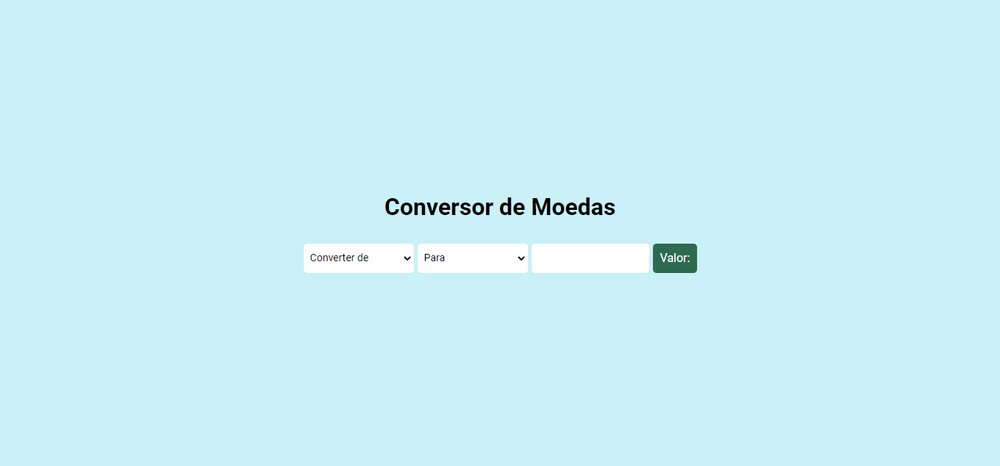

# Conversor de moedas

## Conteúdo
- [Sobre](#sobre)
- [Links](#links)
- [Tecnologias](#tecnologias)
- [Autor](#autor)

## Sobre
Conversor de moedas para as moedas, Real, Dólar Americano, Euro, Iene. Para converter basta selecionar qual a moeda que você irá digitar e depois selecionar qual que você queira que converta.

## Links
- Site - https://dinheiro.netlify.app
- Documentação - https://docs.awesomeapi.com.br/api-de-moedas

## Tecnologias
- HTML
- CSS
- Javascript
- API

## Autor
- Site - https://sanches-spoladore.netlify.app